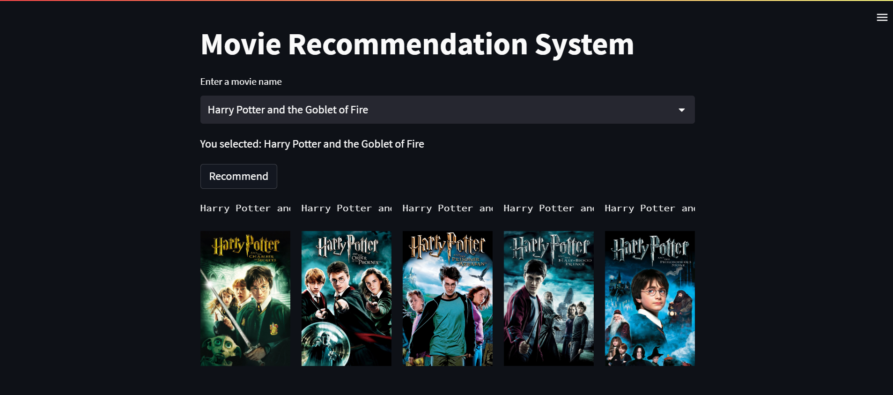

# Movie Recommendation System

 

## Overview

This project implements a content-based movie recommendation system using natural language processing (NLP) techniques and machine learning. The system suggests movies based on content attributes like genres, keywords, cast, and crew details.

## Key Features

- Merged and filtered movie data from the TMDB dataset.
- Processed and cleaned data, converted strings to lists of words.
- Engineered features: genres, keywords, cast, crew, and overviews.
- Utilized stemming for data consistency.
- Transformed data into numerical vectors using CountVectorizer.
- Calculated cosine similarity for content-based movie comparisons.
- Built a recommendation function for personalized movie suggestions.

## Getting Started

1. Clone the repository.
2. Install the required dependencies: `pip install -r requirements.txt`.
3. Run the recommendation system: `python recommend.py`.

## Usage

- Run the recommendation system and input your favorite movie title.
- Receive a list of recommended movies based on content similarity.

## Future Improvements

- Incorporate user ratings for collaborative filtering.
- Enhance the recommendation algorithm using advanced ML techniques.
- Deploy the recommendation system as a web application for user interaction.

## Credits

- Dataset: [TMDB 5000 Movie Dataset](https://www.kaggle.com/tmdb/tmdb-movie-metadata)
- Icon: [Icons8](https://icons8.com/)

## License

This project is licensed under the [MIT License](LICENSE).
